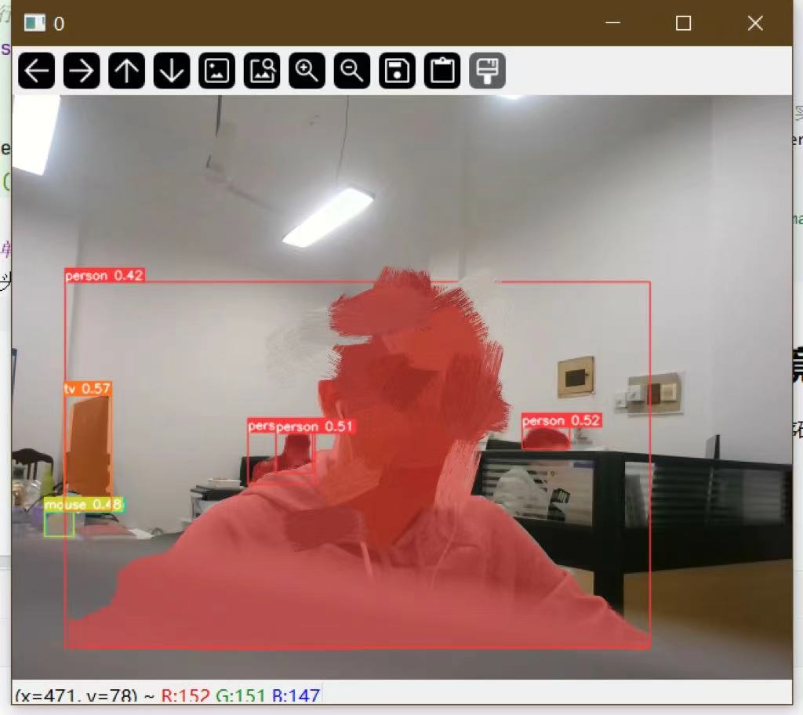

## 主体框架

主函数入口：`./segment/demo.py`

1. 目前是以笔记本的自带相机作为输入，可以实现对相机获取到的信息的语义分割以及实时显示

```python
from predict import run
import cv2


def main():
    camera = '0'
    # 执行语义分割，实时处理，不保存结果
    run(source=camera, nosave=True, line_thickness=1)


if __name__ == '__main__':
    main()
```
## 尝试将单目镜头转换成双目相机
插入双目镜头之后程序确实可以运行，但是仍旧是以单目形式显示的：

对设备进行处理，先利用opencv实现显示，关断操作

```python
ret, frame = capture.read()
while ret:
    # 继续获取下一帧
    ret, frame = capture.read()
    frame1 = frame[0:480, 0:640]
    frame2 = frame[0:480, 640:1280]
    cv2.imshow('left', frame1)


    # 程序终止
    c = cv2.waitKey(1) & 0xff
    if c == 27:
        break
```
打印frame的数据类型:`<class 'numpy.ndarray'>`

梳理梳理思路，我现在需要做的事情，我首先要定位到Yolo的接口，就是处理图像数据的函数或者说加载数据的函数，搞清楚它是如何将相机镜头中获取到的数据转成自己能处理的数据的：

```pyt
 # Dataloader 数据加载器
    bs = 1  # batch_size
    if webcam:
        view_img = check_imshow(warn=True)
        dataset = LoadStreams(source, img_size=imgsz, stride=stride, auto=pt, vid_stride=vid_stride)
        bs = len(dataset)
        print(type(dataset))
    elif screenshot:
        dataset = LoadScreenshots(source, img_size=imgsz, stride=stride, auto=pt)
    else:
        dataset = LoadImages(source, img_size=imgsz, stride=stride, auto=pt, vid_stride=vid_stride)
    vid_path, vid_writer = [None] * bs, [None] * bs
```

上边这一段是数据加载器的代码，主要目的就是针对不同类型的数据进行不同的处理，最终返回一个`dataloader`

然后开始利用构建的这个`dataloader`对数据进行处理：

```py
 # Run inference 进行推断
    # 热身
    model.warmup(imgsz=(1 if pt else bs, 3, *imgsz))  # warmup
    seen, windows, dt = 0, [], (Profile(), Profile(), Profile())
    for path, im, im0s, vid_cap, s in dataset:
        with dt[0]:
            im = torch.from_numpy(im).to(model.device)
            im = im.half() if model.fp16 else im.float()  # uint8 to fp16/32
            im /= 255  # 0 - 255 to 0.0 - 1.0
            if len(im.shape) == 3:
                im = im[None]  # expand for batch dim
```

能推断出来，这个`im`就是获取到的数据。这段代码将数据转成了张量并且放到了设备上，顺着这个代码找数据迭代器`dataloader`的构造代码：

```pytho
from utils.dataloaders import IMG_FORMATS, VID_FORMATS, LoadImages, LoadScreenshots, LoadStreams
```

然后细看这个部分：

```python
class LoadImages:
    # YOLOv5 image/video dataloader, i.e. `python detect.py --source image.jpg/vid.mp4`
    def __init__(self, path, img_size=640, stride=32, auto=True, transforms=None, vid_stride=1):
        if isinstance(path, str) and Path(path).suffix == '.txt':  # *.txt file with img/vid/dir on each line
            path = Path(path).read_text().rsplit()
        files = []
        for p in sorted(path) if isinstance(path, (list, tuple)) else [path]:
            p = str(Path(p).resolve())
            if '*' in p:
                files.extend(sorted(glob.glob(p, recursive=True)))  # glob
            elif os.path.isdir(p):
                files.extend(sorted(glob.glob(os.path.join(p, '*.*'))))  # dir
            elif os.path.isfile(p):
                files.append(p)  # files
            else:
                raise FileNotFoundError(f'{p} does not exist')

        images = [x for x in files if x.split('.')[-1].lower() in IMG_FORMATS]
        videos = [x for x in files if x.split('.')[-1].lower() in VID_FORMATS]
        ni, nv = len(images), len(videos)

        self.img_size = img_size
        self.stride = stride
        self.files = images + videos
        self.nf = ni + nv  # number of files
        self.video_flag = [False] * ni + [True] * nv
        self.mode = 'image'
        self.auto = auto
        self.transforms = transforms  # optional
        self.vid_stride = vid_stride  # video frame-rate stride
        if any(videos):
            self._new_video(videos[0])  # new video
        else:
            self.cap = None
        assert self.nf > 0, f'No images or videos found in {p}. ' \
                            f'Supported formats are:\nimages: {IMG_FORMATS}\nvideos: {VID_FORMATS}'

    def __iter__(self):
        self.count = 0
        return self

    def __next__(self):
        if self.count == self.nf:
            raise StopIteration
        path = self.files[self.count]

        if self.video_flag[self.count]:
            # Read video
            self.mode = 'video'
            for _ in range(self.vid_stride):
                self.cap.grab()
            ret_val, im0 = self.cap.retrieve()
            while not ret_val:
                self.count += 1
                self.cap.release()
                if self.count == self.nf:  # last video
                    raise StopIteration
                path = self.files[self.count]
                self._new_video(path)
                ret_val, im0 = self.cap.read()

            self.frame += 1
            # im0 = self._cv2_rotate(im0)  # for use if cv2 autorotation is False
            s = f'video {self.count + 1}/{self.nf} ({self.frame}/{self.frames}) {path}: '

        else:
            # Read image
            self.count += 1
            im0 = cv2.imread(path)  # BGR
            assert im0 is not None, f'Image Not Found {path}'
            s = f'image {self.count}/{self.nf} {path}: '

        if self.transforms:
            im = self.transforms(im0)  # transforms
        else:
            im = letterbox(im0, self.img_size, stride=self.stride, auto=self.auto)[0]  # padded resize
            im = im.transpose((2, 0, 1))[::-1]  # HWC to CHW, BGR to RGB
            im = np.ascontiguousarray(im)  # contiguous

        return path, im, im0, self.cap, s
```

重要的几个句子：

读取数据，采用的就是`cv2.imread()`:

``` im0 = cv2.imread(path)  # BGR```

读取之后需要进行一定的预处理：

改尺寸、转数据格式、保证连续：

```python
im = letterbox(im0, self.img_size, stride=self.stride, auto=self.auto)[0]  # padded resize
im = im.transpose((2, 0, 1))[::-1]  # HWC to CHW, BGR to RGB
im = np.ascontiguousarray(im)  # contiguous
```

至此我感觉我又行了：

梳理现有代码：

```python
from predict import run
import cv2
from pathlib import Path
import sys
import os
import torch
import numpy as np
import random
from general import non_max_suppression

# 定义letterbox函数
def letterbox(img, new_shape=(416, 416), color=(114, 114, 114), auto=True, scaleFill=False, scaleup=True):
    # Resize image to a 32-pixel-multiple rectangle https://github.com/ultralytics/yolov3/issues/232
    shape = img.shape[:2]  # current shape [height, width]
    if isinstance(new_shape, int):
        new_shape = (new_shape, new_shape)

    # Scale ratio (new / old)
    r = min(new_shape[0] / shape[0], new_shape[1] / shape[1])
    # scaleup为False的话表示图像只能缩小不能放大
    if not scaleup:  # only scale down, do not scale up (for better test mAP)
        r = min(r, 1.0)

    # Compute padding,计算padding的像素大小
    ratio = r, r  # width, height ratios
    new_unpad = int(round(shape[1] * r)), int(round(shape[0] * r))

    dw, dh = new_shape[1] - new_unpad[0], new_shape[0] - new_unpad[1]  # wh padding
    if auto:  # minimum rectangle
        dw, dh = np.mod(dw, 64), np.mod(dh, 64)  # wh padding
    elif scaleFill:  # stretch
        dw, dh = 0.0, 0.0
        new_unpad = new_shape
        ratio = new_shape[0] / shape[1], new_shape[1] / shape[0]  # width, height ratios

    dw /= 2  # divide padding into 2 sides
    dh /= 2

    if shape[::-1] != new_unpad:  # resize
        img = cv2.resize(img, new_unpad, interpolation=cv2.INTER_LINEAR)
    top, bottom = int(round(dh - 0.1)), int(round(dh + 0.1))
    left, right = int(round(dw - 0.1)), int(round(dw + 0.1))
    img = cv2.copyMakeBorder(img, top, bottom, left, right, cv2.BORDER_CONSTANT, value=color)  # add border
    return img, ratio, (dw, dh)


# 关于文件目录的相关操作，保证能把yolov5s-seg.pt调用进来
FILE = Path(__file__).resolve()
ROOT = FILE.parents[1]  # YOLOv5 root directory
if str(ROOT) not in sys.path:
    sys.path.append(str(ROOT))  # add ROOT to PATH
ROOT = Path(os.path.relpath(ROOT, Path.cwd()))  # relative
# model设置以及设备设置
device = torch.device('cuda:0')
model = ROOT / 'yolov5s-seg.pt'  # 加载FP32模型

def main():
    # 读取相机数据
    capture = cv2.VideoCapture(0)
    # 设置相机分辨率
    capture.set(cv2.CAP_PROP_FRAME_WIDTH, 1280)  # 设置宽度 1280分辨率
    capture.set(cv2.CAP_PROP_FRAME_HEIGHT, 480)  # 设置高度 480分辨率
    # 预热，获取一帧
    ret, frame = capture.read()
    while ret:
        # 继续获取下一帧
        ret, frame = capture.read()
        # 分割图像
        frame1 = frame[0:480, 0:640]
        frame2 = frame[0:480, 640:1280]
        # 显示一波
        cv2.imshow('left', frame1)
        cv2.imshow('right',frame2)
        # 程序终止
        c = cv2.waitKey(1) & 0xff
        if c == 27:
            break


if __name__ == '__main__':
    main()

```

选定左侧的图像进行处理，定义函数：

```python
def letterbox(im, new_shape=(640, 640), color=(114, 114, 114), auto=True, scaleFill=False, scaleup=True, stride=32):
    # Resize and pad image while meeting stride-multiple constraints
    shape = im.shape[:2]  # current shape [height, width]
    if isinstance(new_shape, int):
        new_shape = (new_shape, new_shape)

    # Scale ratio (new / old)
    r = min(new_shape[0] / shape[0], new_shape[1] / shape[1])
    if not scaleup:  # only scale down, do not scale up (for better val mAP)
        r = min(r, 1.0)

    # Compute padding
    ratio = r, r  # width, height ratios
    new_unpad = int(round(shape[1] * r)), int(round(shape[0] * r))
    dw, dh = new_shape[1] - new_unpad[0], new_shape[0] - new_unpad[1]  # wh padding
    if auto:  # minimum rectangle
        dw, dh = np.mod(dw, stride), np.mod(dh, stride)  # wh padding
    elif scaleFill:  # stretch
        dw, dh = 0.0, 0.0
        new_unpad = (new_shape[1], new_shape[0])
        ratio = new_shape[1] / shape[1], new_shape[0] / shape[0]  # width, height ratios

    dw /= 2  # divide padding into 2 sides
    dh /= 2

    if shape[::-1] != new_unpad:  # resize
        im = cv2.resize(im, new_unpad, interpolation=cv2.INTER_LINEAR)
    top, bottom = int(round(dh - 0.1)), int(round(dh + 0.1))
    left, right = int(round(dw - 0.1)), int(round(dw + 0.1))
    im = cv2.copyMakeBorder(im, top, bottom, left, right, cv2.BORDER_CONSTANT, value=color)  # add border
    return im, ratio, (dw, dh)

```

图像预处理函数

```python
def process_img(img):
    im = letterbox(img, stride=1)[0]  # padded resize
    im = im.transpose((2, 0, 1))[::-1]  # HWC to CHW, BGR to RGB
    im = np.ascontiguousarray(im)  # contiguous
    return im
```

找到了原始图像之中的letterbox（）函数，对其进行调用，感觉应该是有点问题，对该函数输出维度进行获取

```python
im = process_img(frame1)
        im = cv2.cvtColor(im, cv2.COLOR_BGR2RGB)
        print(im.shape) #(3,480,3) 三行， 480列，3个通道
```

暂时性先不管他，我尝试去拿模型跑

```python
from predict import run
import cv2
from pathlib import Path
import sys
import os
import torch
import numpy as np
import random
from general import non_max_suppression
from models.common import DetectMultiBackend
from ultralytics.utils.plotting import Annotator, colors, save_one_box
from utils.segment.general import masks2segments, process_mask, process_mask_native
from utils.general import (LOGGER, Profile, check_file, check_img_size, check_imshow, check_requirements, colorstr, cv2,
                           increment_path, non_max_suppression, print_args, scale_boxes, scale_segments,
                           strip_optimizer)

# 定义letterbox函数
def letterbox(im, new_shape=(640, 640), color=(114, 114, 114), auto=True, scaleFill=False, scaleup=True, stride=32):
    # Resize and pad image while meeting stride-multiple constraints
    shape = im.shape[:2]  # current shape [height, width]
    if isinstance(new_shape, int):
        new_shape = (new_shape, new_shape)

    # Scale ratio (new / old)
    r = min(new_shape[0] / shape[0], new_shape[1] / shape[1])
    if not scaleup:  # only scale down, do not scale up (for better val mAP)
        r = min(r, 1.0)

    # Compute padding
    ratio = r, r  # width, height ratios
    new_unpad = int(round(shape[1] * r)), int(round(shape[0] * r))
    dw, dh = new_shape[1] - new_unpad[0], new_shape[0] - new_unpad[1]  # wh padding
    if auto:  # minimum rectangle
        dw, dh = np.mod(dw, stride), np.mod(dh, stride)  # wh padding
    elif scaleFill:  # stretch
        dw, dh = 0.0, 0.0
        new_unpad = (new_shape[1], new_shape[0])
        ratio = new_shape[1] / shape[1], new_shape[0] / shape[0]  # width, height ratios

    dw /= 2  # divide padding into 2 sides
    dh /= 2

    if shape[::-1] != new_unpad:  # resize
        im = cv2.resize(im, new_unpad, interpolation=cv2.INTER_LINEAR)
    top, bottom = int(round(dh - 0.1)), int(round(dh + 0.1))
    left, right = int(round(dw - 0.1)), int(round(dw + 0.1))
    im = cv2.copyMakeBorder(im, top, bottom, left, right, cv2.BORDER_CONSTANT, value=color)  # add border
    return im, ratio, (dw, dh)


# 关于文件目录的相关操作，保证能把yolov5s-seg.pt调用进来
FILE = Path(__file__).resolve()
ROOT = FILE.parents[1]  # YOLOv5 root directory
if str(ROOT) not in sys.path:
    sys.path.append(str(ROOT))  # add ROOT to PATH
ROOT = Path(os.path.relpath(ROOT, Path.cwd()))  # relative
# model设置以及设备设置
device = torch.device('cuda:0')
weights = ROOT / 'yolov5s-seg.pt'  # 加载FP32模型
model = DetectMultiBackend(weights=weights, device=device, dnn=False, fp16=True)


def process_img(img):
    im = letterbox(img, stride=1)[0]  # padded resize
    im = im.transpose((2, 0, 1))[::-1]  # HWC to CHW, BGR to RGB
    im = np.ascontiguousarray(im)  # contiguous
    return im


def main():
    # 读取相机数据
    capture = cv2.VideoCapture(0)
    # 设置相机分辨率
    capture.set(cv2.CAP_PROP_FRAME_WIDTH, 1280)  # 设置宽度 1280分辨率
    capture.set(cv2.CAP_PROP_FRAME_HEIGHT, 480)  # 设置高度 480分辨率
    # 预热，获取一帧
    ret, frame = capture.read()
    while ret:
        # 继续获取下一帧
        print(1)
        capture.grab()
        ret, frame = capture.retrieve()
        # 分割图像
        frame1 = frame[0:480, 0:640]
        frame2 = frame[0:480, 640:1280]
        # print(type(frame1))
        im = process_img(frame1)
        im = cv2.cvtColor(im, cv2.COLOR_BGR2RGB)
        print(im.shape) #(3,480,3) 三行， 480列，3个通道
        im = torch.from_numpy(im).to(device)
        im = im.float()  # uint8 to fp16/32
        im /= 255  # 0 - 255 to 0.0 - 1.0
        if len(im.shape) == 3:
            im = im[None]  # expand for batch dim
        pred, proto = model(im, augment=False )[:2]
        pred = non_max_suppression(pred,0.25, 0.45, classes=None, agnostic=False)
        for i, det in enumerate(pred):
            annotator = Annotator(frame1, line_width=1, example=str(model.names)) # 继承对象 用来绘制
            if len(det):
                masks = process_mask(proto[i], det[:, 6:], det[:, :4], im.shape[2:], upsample=True)  # HWC
                det[:, :4] = scale_boxes(im.shape[2:], det[:, :4], frame1.shape).round()  # rescale boxes to im0 size
                # Mask plotting 绘制掩膜
                retina_masks =False
                annotator.masks(masks, colors=[colors(x, True) for x in det[:, 5]],im_gpu=torch.as_tensor(frame1, dtype=torch.float16).to(device).permute(2, 0, 1).flip(
                                    0).contiguous() /55 if retina_masks else im[i])
        im0 = annotator.result()
        cv2.imshow('frame', im0)
        # 显示一波
        cv2.imshow('left', frame1)
        cv2.imshow('right', frame2)

        # 程序终止
        c = cv2.waitKey(1) & 0xff
        if c == 27:
            break


if __name__ == '__main__':
    main()
```

第92行报错：

```python
Fusing layers... 
YOLOv5s-seg summary: 224 layers, 7611485 parameters, 0 gradients, 26.4 GFLOPs
1
(3, 480, 3)
Traceback (most recent call last):
  File "F:\Yolo\Yolov5\yolov5-master\segment\demo.py", line 120, in <module>
    main()
  File "F:\Yolo\Yolov5\yolov5-master\segment\demo.py", line 96, in main
    pred, proto = model(im, augment=False )[:2]
  File "D:\Anaconda\envs\Hello\lib\site-packages\torch\nn\modules\module.py", line 1501, in _call_impl
    return forward_call(*args, **kwargs)
  File "F:\Yolo\Yolov5\yolov5-master\models\common.py", line 527, in forward
    y = self.model(im, augment=augment, visualize=visualize) if augment or visualize else self.model(im)
  File "D:\Anaconda\envs\Hello\lib\site-packages\torch\nn\modules\module.py", line 1501, in _call_impl
    return forward_call(*args, **kwargs)
  File "F:\Yolo\Yolov5\yolov5-master\models\yolo.py", line 209, in forward
    return self._forward_once(x, profile, visualize)  # single-scale inference, train
  File "F:\Yolo\Yolov5\yolov5-master\models\yolo.py", line 121, in _forward_once
    x = m(x)  # run
  File "D:\Anaconda\envs\Hello\lib\site-packages\torch\nn\modules\module.py", line 1501, in _call_impl
    return forward_call(*args, **kwargs)
  File "F:\Yolo\Yolov5\yolov5-master\models\common.py", line 324, in forward
    return torch.cat(x, self.d)
RuntimeError: Sizes of tensors must match except in dimension 1. Expected size 2 but got size 1 for tensor number 1 in the list.
```


查看原文件输入模型的`im`的维度：

`torch.Size([1, 3, 480, 640])`

然后自己的那个代码的`im`维度：

`torch.Size([3, 480, 3]) `

不对劲，问题出在调用模型之前，我之前参考的那个就乱七八糟，最终发现是转成灰度之后，相当于把一个维度砍掉了，删除掉对应代码之后就可以了。删除的代码：

```python
im = cv2.cvtColor(im, cv2.COLOR_BGR2RGB)
```

对应的在模型输入前的数据维度为：`torch.Size([1, 3, 480, 640]) -------------`

重新运行报错：

```python
raceback (most recent call last):
  File "F:\Yolo\Yolov5\yolov5-master\segment\demo.py", line 123, in <module>
    main()
  File "F:\Yolo\Yolov5\yolov5-master\segment\demo.py", line 101, in main
    annotator = Annotator(frame1, line_width=1, example=str(model.names))  # 继承对象 用来绘制
  File "D:\Anaconda\envs\Hello\lib\site-packages\ultralytics\utils\plotting.py", line 76, in __init__
    assert im.data.contiguous, 'Image not contiguous. Apply np.ascontiguousarray(im) to Annotator() input images.'
AssertionError: Image not contiguous. Apply np.ascontiguousarray(im) to Annotator() input images.
```

问题出在绘图对象`annotator`之上。

按照报错的提示对代码进行调整，增加语句

```python
        for i, det in enumerate(pred):
            frame1 = np.ascontiguousarray(frame1)
            annotator = Annotator(frame1, line_width=1, example=str(model.names))  # 继承对象 用来绘制
```

这个`Annotator`要求输入的图像的内存地址是连续的，添加的` frame1 = np.ascontiguousarray(frame1)`就是用来干这个的

重新运行，报错：

```python
Traceback (most recent call last):
  File "F:\Yolo\Yolov5\yolov5-master\segment\demo.py", line 124, in <module>
    main()
  File "F:\Yolo\Yolov5\yolov5-master\segment\demo.py", line 104, in main
    masks = process_mask(proto[i], det[:, 6:], det[:, :4], im.shape[2:], upsample=True)  # HWC
  File "F:\Yolo\Yolov5\yolov5-master\utils\segment\general.py", line 56, in process_mask
    masks = (masks_in @ protos.float().view(c, -1)).sigmoid().view(-1, mh, mw)  # CHW
RuntimeError: mat1 and mat2 shapes cannot be multiplied (15x0 and 32x19200)
```

问题出在`masks = process_mask(proto[i], det[:, 6:], det[:, :4], im.shape[2:], upsample=True)`这一句里边，这一句的输入是一个proto、det、以及im，然后报错内容也是维度不匹配，无法相乘，所以对以上三者的数据维度进行检测，im刚刚查过了，应该没问题，主要看另外两个

检查proto和det维度：

```python
proto: torch.Size([1, 32, 120, 160])
det: torch.Size([11, 6])
```

检查源程序内容

```python
proto: torch.Size([1, 32, 120, 160])
det: torch.Size([9, 38])
```

`det` 有问题，查找det的位置，与其相关的句子为：

```python
pred = non_max_suppression(pred, 0.25, 0.45, classes=None, agnostic=False, max_det=1000, nm=32)
```

以及：

```python
for i, det in enumerate(pred):
```

所以对照源程序对demo进行修改，修改后的非极大值抑制代码为：

```python
pred = non_max_suppression(pred, 0.25, 0.45, classes=None, agnostic=False, max_det=1000, nm=32)
```

这样的话就可以运行了！！！！！！！！！！！！！！！！！！！！！！！！！！！！！！！！！！

添加bounding_box模块，并且规范化显示图像，在frame窗口上显示语义分割图像以及锚框：

```python
        if len(det):
            masks = process_mask(proto[i], det[:, 6:], det[:, :4], im.shape[2:], upsample=True)  # HWC
            det[:, :4] = scale_boxes(im.shape[2:], det[:, :4], predict.shape).round()  # rescale boxes to im0 size
        for c in det[:, 5].unique():
            n = (det[:, 5] == c).sum()  # detections per class
            s += f"{n} {names[int(c)]}{'s' * (n > 1)}, "  # add to string
            # Mask plotting 绘制掩膜
            retina_masks = False
            annotator.masks(masks, colors=[colors(x, True) for x in det[:, 5]],
                            im_gpu=torch.as_tensor(predict, dtype=torch.float16).to(device).permute(2, 0, 1).flip(
                                0).contiguous() / 55 if retina_masks else im[i])
            # 绘制bounding box
            for j, (*xyxy, conf, cls) in enumerate(reversed(det[:, :6])):
                # if save_img or save_crop or view_img:  # Add bbox to image
                c = int(cls)  # integer class
                label = f'{names[c]} {conf:.2f}'
                annotator.box_label(xyxy, label, color=colors(c, True))
                # annotator.draw.polygon(segments[j], outline=colors(c, True), width=3)
                # if save_crop:
                #     save_one_box(xyxy, imc, file=save_dir / 'crops' / names[c] / f'{p.stem}.jpg', BGR=True)
```

对代码进行整理，相应的功能进行函数化封装：

导包取代原有的复制粘贴`letterbox`函数：

```python
from utils.augmentations import letterbox
```

预处理函数`process_img`:

```python
def process_img(img):
    im = letterbox(img, stride=1)[0]  # padded resize
    im = im.transpose((2, 0, 1))[::-1]  # HWC to CHW, BGR to RGB
    im = np.ascontiguousarray(im)  # contiguous
    im = torch.from_numpy(im).to(device)
    im = im.float()
    im /= 255  # 0 - 255 to 0.0 - 1.0
    # 添加一个维度，添加的这个维度指的是批量数
    if len(im.shape) == 3:
        im = im[None]  # expand for batch dim
    return im
```

部署`yolo`实现语义分割并且绘制相应的`bbox`以及对应标签：

```python
def Annotator1(frame1, names=model.names):
    im = process_img(frame1)  # print('im：', im.shape)  # im： (3, 480, 640)
    s = '%gx%g ' % im.shape[2:]  # print string  # 打印标签
    # 将图像加载到模型上
    pred, proto = model(im, augment=False)[:2]
    # 应用非极大值抑制
    pred = non_max_suppression(pred, 0.25, 0.45, classes=None, agnostic=False, max_det=1000, nm=32)
    for i, det in enumerate(pred):
        # print('det:', det.shape)
        predict = np.ascontiguousarray(frame1)
        annotator = Annotator(predict, line_width=1, example=str(model.names))  # 继承对象 用来绘制
        if len(det):
            masks = process_mask(proto[i], det[:, 6:], det[:, :4], im.shape[2:], upsample=True)  # HWC
            det[:, :4] = scale_boxes(im.shape[2:], det[:, :4], predict.shape).round()  # rescale boxes to im0 size
        for c in det[:, 5].unique():
            n = (det[:, 5] == c).sum()  # detections per class
            s += f"{n} {names[int(c)]}{'s' * (n > 1)}, "  # add to string
            # Mask plotting 绘制掩膜
            retina_masks = False
            annotator.masks(masks, colors=[colors(x, True) for x in det[:, 5]],
                            im_gpu=torch.as_tensor(predict, dtype=torch.float16).to(device).permute(2, 0, 1).flip(
                                0).contiguous() / 55 if retina_masks else im[i])
            # 绘制bounding box
            for j, (*xyxy, conf, cls) in enumerate(reversed(det[:, :6])):
                # if save_img or save_crop or view_img:  # Add bbox to image
                c = int(cls)  # integer class
                label = f'{names[c]} {conf:.2f}'
                annotator.box_label(xyxy, label, color=colors(c, True))
                # annotator.draw.polygon(segments[j], outline=colors(c, True), width=3)
                # if save_crop:
                #     save_one_box(xyxy, imc, file=save_dir / 'crops' / names[c] / f'{p.stem}.jpg', BGR=True)
    return annotator.result()
```

基础设置部分：

```python
# 关于文件目录的相关操作，保证能把yolov5s-seg.pt调用进来
FILE = Path(__file__).resolve()
ROOT = FILE.parents[1]  # YOLOv5 root directory
if str(ROOT) not in sys.path:
    sys.path.append(str(ROOT))  # add ROOT to PATH
ROOT = Path(os.path.relpath(ROOT, Path.cwd()))  # relative
# model设置以及设备设置
device = torch.device('cuda:0')
weights = ROOT / 'yolov5s-seg.pt'  # 加载FP32模型
model = DetectMultiBackend(weights=weights, device=device, dnn=False, fp16=True)
```

主函数：

```python
def main():
    # 读取相机数据
    capture = cv2.VideoCapture(0)
    # 设置相机分辨率
    capture.set(cv2.CAP_PROP_FRAME_WIDTH, 1280)  # 设置宽度 1280分辨率
    capture.set(cv2.CAP_PROP_FRAME_HEIGHT, 480)  # 设置高度 480分辨率
    # 预热，获取一帧
    ret, frame = capture.read()
    while ret:
        # 继续获取下一帧
        capture.grab()
        ret, frame = capture.retrieve()
        # 分割图像
        frame1 = frame[0:480, 0:640]
        frame2 = frame[0:480, 640:1280]  # print('fram1：', frame1.shape)  # fram1： (480, 640, 3)
        im0 = Annotator1(frame1)
        # 显示图像
        cv2.imshow('left', frame1)  # 左侧图像显示
        cv2.imshow('right', frame2)  # 右侧图像显示
        cv2.imshow('frame', im0)  # 有语义分割的
        # 程序终止
        c = cv2.waitKey(1) & 0xff
        if c == 27:
            break
```

至此调用`Yolo_segmatation_API`初步实现，接下来需要部署深度模型对两幅图像进行深度估计。

第一个目标，首先实现对两幅图像上全部像素点的估计：

把之前相机标定好的内外参导进来：

```python
from camera import *
```

然后添加代码：

```python
## 开启深度估计部分：
imgL = cv2.cvtColor(frame1, cv2.COLOR_BGR2GRAY)
imgR = cv2.cvtColor(frame2, cv2.COLOR_BGR2GRAY)
img1_rectified = cv2.remap(imgL, left_map1, left_map2, cv2.INTER_LINEAR)
img2_rectified = cv2.remap(imgR, right_map1, right_map2, cv2.INTER_LINEAR)
blockSize = 8
img_channels = 3
stereo = cv2.StereoSGBM_create(minDisparity=1,
                               numDisparities=64,
                               blockSize=blockSize,
                               P1=8 * img_channels * blockSize * blockSize,
                               P2=32 * img_channels * blockSize * blockSize,
                               disp12MaxDiff=-1,
                               preFilterCap=1,
                               uniquenessRatio=10,
                               speckleWindowSize=100,
                               speckleRange=100,
                               mode=cv2.STEREO_SGBM_MODE_HH)
# 计算视差
disparity = stereo.compute(img1_rectified, img2_rectified)
# 生成深度图（颜色图）
dis_color = disparity
dis_color = cv2.normalize(dis_color, None, alpha=0, beta=255, norm_type=cv2.NORM_MINMAX, dtype=cv2.CV_8U)
dis_color = cv2.applyColorMap(dis_color, 2)

# 计算三维坐标数据值
threeD = cv2.reprojectImageTo3D(disparity, Q, handleMissingValues=True)
# print(threeD.shape)
# 计算出的threeD，需要乘以16，才等于现实中的距离
threeD = threeD * 16
cv2.imshow("depth", dis_color)
```

这里的threeD暂时还没有用到，先mark一下，这个矩阵是像素点在相机坐标系下的三维尺寸。

然后我对这个深度估计这一套东西进行封装，两个函数叭，一个函数用来实现对单个相机的处理，就是转灰度啊，匹配啊这些。涉及到对两幅图像进行操作的我就封装到另外一个函数里边。两个函数分别命名为`pre_depth()`和`depth()`

涉及到的代码：

`pre_depth`:

```python
def pre_depth(img):
    img = cv2.cvtColor(img, cv2.COLOR_BGR2GRAY)
    img_rectified = cv2.remap(img, left_map1, left_map2, cv2.INTER_LINEAR)
    return img_rectified
```

`depth`:

```python
def depth(frame1, frame2, blockSize=8, img_channels=3):
    frame1_rectified = pre_depth(frame1)
    frame2_rectified = pre_depth(frame2)
    stereo = cv2.StereoSGBM_create(minDisparity=1,
                                   numDisparities=64,
                                   blockSize=blockSize,
                                   P1=8 * img_channels * blockSize * blockSize,
                                   P2=32 * img_channels * blockSize * blockSize,
                                   disp12MaxDiff=-1,
                                   preFilterCap=1,
                                   uniquenessRatio=10,
                                   speckleWindowSize=100,
                                   speckleRange=100,
                                   mode=cv2.STEREO_SGBM_MODE_HH)
    # 计算视差
    disparity = stereo.compute(frame1_rectified, frame2_rectified)
    # 生成深度图（颜色图）
    dis_color = disparity
    dis_color = cv2.normalize(dis_color, None, alpha=0, beta=255, norm_type=cv2.NORM_MINMAX, dtype=cv2.CV_8U)
    dis_color = cv2.applyColorMap(dis_color, 2)
    return dis_color, disparity
```

函数调用：

```python
# 开启深度估计部分：
dis_color, disparity = depth(frame1, frame2)
 # 计算三维坐标数据值
        threeD = cv2.reprojectImageTo3D(disparity, Q, handleMissingValues=True)
        # 计算出的threeD，需要乘以16，才等于现实中的距离
        threeD = threeD * 16
        cv2.imshow("depth", dis_color)
```

暂时性完成目标，然后下个目标是要把掩膜对应的像素抠出来

# 转回项目本身

参考

[](https://blog.csdn.net/weixin_43639743/article/details/107382571)

这个Yolo需要设置源目录，简单来说就是Yolo在调用自己内部的包的时候可能会与系统的库冲突导致报错。

为了方便后期继续修改，我去创建好的git文件里边去重新归纳一下代码结构
